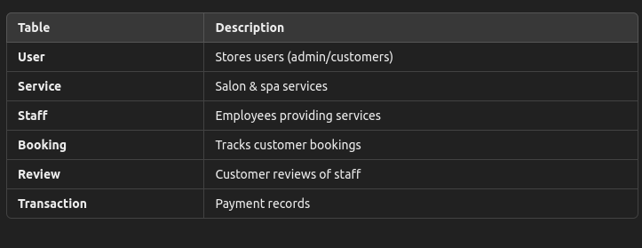

# Angelic Beauty Shop  

## Overview  

Angelic Beauty Shop is a **full-stack** web application for managing beauty salon and spa services. It supports **role-based access control (RBAC)**, allowing **customers** to book services and review staff, while **admins** manage services, staff, transactions, and reports.  

## Features  

###  **User Authentication & RBAC**  

- Secure login with **JWT & bcrypt**  
- **Customers**: Book services, leave reviews  
- **Admins**: Manage staff, services, transactions, and reports  

### **Service Booking & Staff Reviews**  

- Customers **book** services and **review staff**  
- Admins can **manually add transactions**  

### **Admin Dashboard & Reports**  

- View **daily, weekly, and monthly revenue**  
- Track **most booked staff & services**  
- Display **urgent bookings in real-time**  

## Tech Stack 🛠️  

**Backend:** Flask, Flask-RESTful, Flask-JWT-Extended, Flask-SQLAlchemy, SQLite  
**Frontend:** Next.js, Tailwind CSS, Axios, React Query(Repository: <https://github.com/Melrwa/client> )  
**Database:**  SQLite (Dev)  

## Installation 🚀  

### 1️⃣ **Clone the Repository**  

```bash
git clone https://github.com/Melrwa/Angelic-Beauty.git
cd Angelic-Beauty

git clone https://github.com/Melrwa/client.git

```

### 2 **Backend Setup**

```bash
pipenv install  
pipenv shell  
flask db upgrade  
flask run  
```

### 3 **Frontend Setup**

```bash
cd client
npm install  
npm run dev  
```


## API Endpoints 🌐

**Authentication**

- `POST /login` – Authenticate user
- `/signup`  – Register a member

**Services && Bookings**

- `GET /services` – View all services
- `POST /bookings` – Book a service
- `GET /bookings/user/<id>` – Get user bookings

**Staff && Review**

- `GET /staff` – View all staff
- `POST /reviews` – Submit a review
- `GET /reviews/staff/<id>` – Get staff reviews

**Admin && Reports**

- `GET /reports` – Daily weekly and monthly reports 
- `GET /transactions` -Get all transactions


## Databasa Schema




## Contribution 

Contribution is most welcomed  just fork and clone the Repo

## Licence

MIT License

## Author

***Melkizedek Orwa***